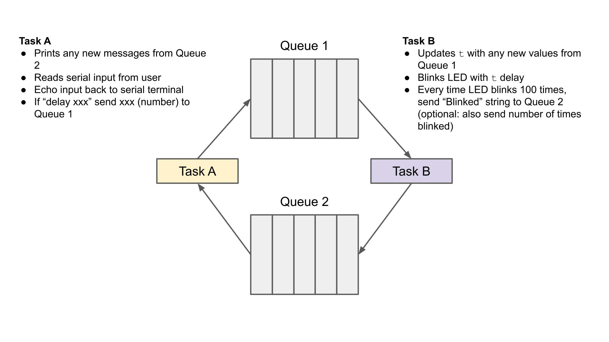

This repository tracks my progress in the [Digikey Introduction to FreeRTOS](https://www.youtube.com/playlist?list=PLEBQazB0HUyQ4hAPU1cJED6t3DU0h34bz).

1. [x] Get a blinky+usb cdc stream running on real RP2040 hardware
2. [x] Get FreeRTOS installed and get a pure blinky running as a task
3. [x] Get usb cdc stream working in a task 

# Setup

## Clone
```
cd ~
git clone https://github.com/kwan3217/rp2040_freertos_tutorial.git
cd rp2040_freertos_tutorial
git submodule update --init --recursive
```

## Toolchain

```
sudo apt update
sudo apt install -y git cmake build-essential gcc-arm-none-eabi libnewlib-arm-none-eabi libstdc++-arm-none-eabi-newlib python3 libusb-1.0-0-dev
```

## picotool
I don't think I've used picotool yet.
```
cd ~
git clone https://github.com/raspberrypi/picotool.git
cd picotool
mkdir build
cd build
PICO_SDK_PATH=~/rp2040_freertos_tutorial/pico-sdk/ cmake ..
make
sudo make install
```

## Build and Upload
To build an image:

```
cd rp2040_freertos_tutorial
rm -rfv build
mkdir build
cd build
cmake .. -DCMAKE_VERBOSE_MAKEFILE=OFF # or ON to have make print the commands before each is executed
make -j9 # make with 9 threads, generally use 1 more than cores
```
This builds build/rp2040_freertos_tutorial.uf2

To upload the image:
* Unplug the pico USB
* Hold down the pico BOOTSEL
* Plug in USB. Pico will enumerate as a mass storage device, `/media/<user>/RPI-RP2` in Linux
* Copy the uf2 to the Pico `cp -av build/rp2040_freertos_tutorial.uf2 /media/$USER/RPI-RP2`
When the copy finishes, the Pico will restart running the new firmware.

# Lessons

## Lesson 0 - fight with compilers and toolchains
The process is:
* get pico-sdk
* write a blinky in `main.c`
* Fight with the cmakelists.txt until it builds and works (fighting complete). Tagged as `lesson0_blinky_no_freertos`
* get FreeRTOS
* Fight with the cmakelists.txt until it builds and works with freertos even though it isn't used yet (fighting complete). Tagged as `lesson0_blinky_freertos_unused`
  * The biggest thing was to include the correct FreeRTOS *.cmake file
* Update main.c to actually start some tasks -- one to blink the LED and one to print to USB stream
* Fight with the cmakelists.txt until it builds and works with actual freertos tasks (fighting complete). Tagged as `lesson0_blinky_freertos`


## Lesson 1 - Why an RTOS?
[Web Page](https://www.digikey.com/en/maker/projects/what-is-a-realtime-operating-system-rtos/28d8087f53844decafa5000d89608016)
[Video](https://www.youtube.com/watch?v=F321087yYy4)
No code for this lesson

## Lesson 2 - Two tasks
[Web page](https://www.digikey.com/en/maker/projects/introduction-to-rtos-solution-to-part-2-freertos/b3f84c9c9455439ca2dcb8ccfce9dec5)
[Video](https://www.youtube.com/watch?v=JIr7Xm_riRs)

### Challenge

> Using FreeRTOS, create two separate tasks that blink the same LED at two different rates. That means controlling 1 LED with two different delay times.

I interpret this as meaning that the two tasks each have their own led state, toggle it internally and independently, 
then set the led to whatever the state is. This might mean that task 2 sets the LED to the same state that task 1 already did. Use two three-digit prime
numbers different by more than a factor of 2 so that it takes a *long* time for the cycle to repeat.

### My Solution
I use the same task function to do both tasks. Task functions take a parameter in the form of a void pointer. 
This can be used to pass a pointer to a memory block with an arbitrary structure, but in this problem I want to
pass a delay length, so I just cast the delay length in ticks to a pointer, then cast back to an integer
inside the function.

## Lesson 3 - non-blocking USB input

### Challenge

> Using FreeRTOS, create two separate tasks. One listens for an integer over UART 
  (from the Serial Monitor) and sets a variable when it sees an integer. The other 
  task blinks the onboard LED (or other connected LED) at a rate specified by that 
  integer. In effect, you want to create a multi-threaded system that allows for 
  the user interface to run concurrently with the control task (the blinking LED).

### My Solution
Set up a read task. First effort used `scanf()` which works, but only because priority 
is just right. If priority of the reading task was higher, it would block but never yield.

Second effort uses pico_sdk function `getchar_timeout_us(0)` which returns immediately
with either a char or "no char ready". If there is a char ready, check if it's a digit.
If it is, accumulate the digit. if not, set the delay if we saw any digits, then reset 
the accumulator.

## Lesson 4 - Memory Allocation

### Challenge
> Using FreeRTOS, create two separate tasks. One listens for input over UART (from the
  Serial Monitor). Upon receiving a newline character (‘\n’), the task allocates a 
  new section of heap memory (using pvPortMalloc()) and stores the string up to the
  newline character in that section of heap. It then notifies the second task that a
  message is ready.
> 
> The second task waits for notification from the first task. When it receives that 
  notification, it prints the message in heap memory to the Serial Monitor. Finally,
  it deletes the allocated heap memory (using vPortFree()).

This is before the queue section, so we will (inappropriately) use global variables. 
We will carefully use volatile global variables even though queues are more appropriate
(we haven't reached that lesson yet)

## Lesson 5 - Queues

### Challenge
> Use FreeRTOS to create two tasks and two queues.
> 
> 
>
> Task A should print any new messages it receives from Queue 2. Additionally, it
  should read any Serial input from the user and echo back this input to the serial
  input. If the user enters “delay” followed by a space and a number, it should
  send that number to Queue 1.
>
> Task B should read any messages from Queue 1. If it contains a number, it should
  update its delay rate to that number (milliseconds). It should also blink an LED
  at a rate specified by that delay. Additionally, every time the LED blinks 100 
  times, it should send the string “Blinked” to Queue 2. You can also optionally send
  the number of times the LED blinked (e.g. 100) as part of struct that encapsulates
  the string and this number.
 
This is implemented very directly. Task A could be decomposed into a usb reading task and a
usb printing task, but that's not the spec.